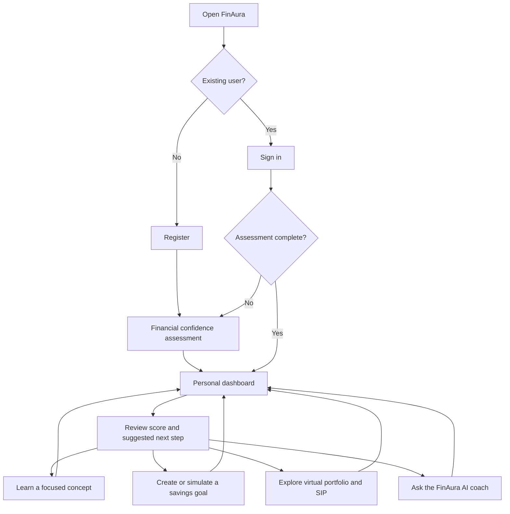
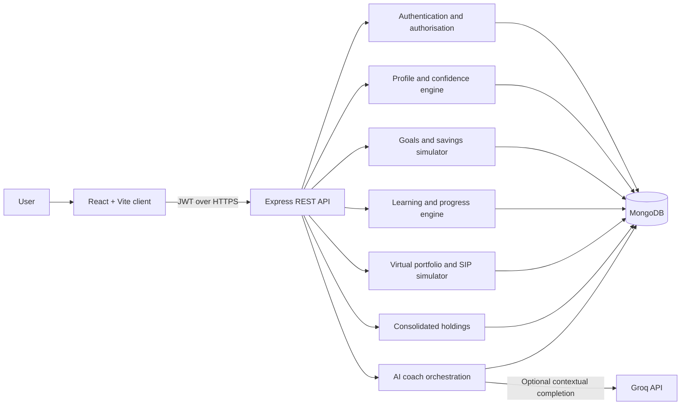
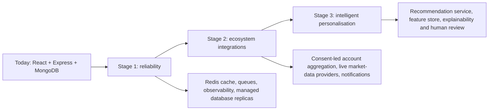

# FinAura — financial confidence, before financial commitment

> **Most young Indians do not need another stock tip. They need a clear next step they can trust.**

FinAura is a personalised, education-first WealthTech companion that helps first-time investors turn uncertainty into action. It converts a user’s income, spending, goals and risk understanding into a financial-confidence score, a learning path, a safe virtual investment space and practical, explainable guidance.

Built for **CodeFury Hackathon 2026** under *WealthTech & Investment Solutions* by **Team 404**.


## The problem we are solving

Financial literacy is increasing, but financial confidence is not. A student may start an SIP without understanding volatility; a professional may have investments across platforms but no consolidated view; and a first-time investor may mistake social-media hype for advice. The result is anxiety, fragmented decisions and avoidable risk.

FinAura closes the gap between knowing a financial term and making a thoughtful decision. Instead of overwhelming people with charts or pushing products, it answers: **Where am I today? What should I learn next? What can I safely try before using real money?**

## Our solution

FinAura makes personal finance feel like a guided journey, not a test.

| Need | FinAura response | User outcome |
| --- | --- | --- |
| “I don’t know where to start.” | Financial-confidence assessment and category scores | A clear, personalised starting point |
| “I have a goal, but no plan.” | Goal creation, savings simulations and progress tracking | A visible path from intention to action |
| “I’m unsure about investment risk.” | Educational risk profile, contextual lessons and explainers | More informed choices—not blind tips |
| “I want to learn by doing.” | ₹1,00,000 virtual portfolio, simulated assets and SIP practice | Experience without risking real money |
| “Advice online is confusing.” | Profile-aware AI coach with a safety-first fallback | Plain-language, contextual guidance |
| “My investments are scattered.” | Consolidated-holdings workspace | A single view of recorded investments |

### What makes FinAura different

- **Confidence before commitment:** the product begins with understanding, not a trade button.
- **One connected journey:** assessment → learning → planning → safe practice → reflection.
- **Actionable, not intimidating:** each dashboard state highlights one relevant next step.
- **Designed for India:** INR-first planning, SIP learning, familiar instruments and Indian financial context.
- **Safety by design:** simulated trades only; FinAura is an educational platform, not an investment adviser or execution platform.

## Core experience

1. **Onboard securely** — create an account and enter a private workspace.
2. **Understand yourself** — complete a short assessment with income, expenses, savings and financial-behaviour prompts.
3. **See the signal** — receive an overall financial-confidence score and category-level strengths/gaps.
4. **Act on one next step** — follow focused lessons, create goals or use planning tools.
5. **Practise safely** — explore a virtual portfolio, simulated market movements and virtual SIPs.
6. **Reflect and improve** — track progress, revisit goals and ask the AI coach informed questions.

## User-flow diagram



## Present system design

FinAura is a MERN application with a React single-page client and a protected Express API. The server coordinates assessment logic, goals, learning progress, virtual investments, portfolio consolidation and assistant context. MongoDB stores user-owned data; Groq is used only for optional AI responses, with a structured local fallback when unavailable.



### Current architecture at a glance

| Layer | Technology | Responsibility |
| --- | --- | --- |
| Experience | React 19, Vite, Tailwind CSS, React Router | Responsive dashboard, learning and planning flows |
| API | Node.js, Express | REST endpoints, validation and business logic |
| Identity | JWT, bcrypt | Registration, login, protected routes and user isolation |
| Data | MongoDB with Mongoose | Profiles, scores, goals, learning progress, virtual portfolios and transactions |
| Guidance | Groq API + deterministic fallback | Contextual educational responses, with a reliable no-key fallback |
| Protection | Helmet, CORS, rate limits | Baseline HTTP hardening and abuse controls |

### Key data domains

`User` · `FinancialProfile` · `Goal` · `Portfolio` · `Transaction` · `Sip` · `ConsolidatedPortfolio` · `Asset` · `Course` · `Lesson` · `Quiz` · `UserProgress` · `Badge`

Each core record is tied to the authenticated user, keeping data boundaries simple and explicit.

## Scalable future: from prototype to trusted financial companion

FinAura’s present monolith is intentionally fast to build and easy to demo. Its domain boundaries make the next stages practical rather than speculative.



### Roadmap

**Stage 1 — Build for reliability (0–6 months)**

- Containerise the API and client; deploy behind a load balancer with autoscaling.
- Add Redis for cache/session-adjacent data and a job queue for reminders, SIP schedules and reports.
- Use MongoDB indexes, replica sets, encrypted backups and monitoring/alerting.
- Introduce API versioning, automated tests, CI/CD and audit logs for sensitive actions.

**Stage 2 — Connect the financial picture (6–12 months)**

- Add consent-led account aggregation only through regulated, approved partners.
- Integrate licensed market-data providers with clear freshness labels and fallback behaviour.
- Offer encrypted document import, portfolio categorisation and goal-health notifications.
- Build a multilingual and accessibility-first experience for broader Indian adoption.

**Stage 3 — Personalise responsibly (12+ months)**

- Separate recommendation, notification and analytics services as demand grows.
- Use an event stream for activity signals while preserving user consent and data minimisation.
- Provide explainable recommendations: what changed, why it matters and what the user can do next.
- Add advisor/human-review workflows for regulated journeys—never opaque automated financial advice.

### Trust, privacy and safety commitments

- We never execute real trades in the current product; portfolio activity is simulated.
- Passwords are hashed; authenticated API routes use JWT protection.
- CORS, Helmet and rate limits are enabled at the API boundary.
- Production expansion will require explicit user consent, encryption at rest/in transit, least-privilege access, retention controls and appropriate regulatory review.
- AI outputs are educational guidance, not a promise of returns or personalised investment advice.

## Technology stack

| Area | Tools |
| --- | --- |
| Frontend | React, Vite, Tailwind CSS, React Router, Recharts, Lucide |
| Backend | Node.js, Express, Mongoose |
| Database | MongoDB |
| Security | JWT, bcryptjs, Helmet, CORS, express-rate-limit |
| AI assistance | Groq-compatible chat completions with deterministic fallback |
| Developer tooling | npm, Nodemon, Concurrently |

## Run locally

### Prerequisites

- Node.js 18+
- MongoDB (local or hosted)
- A Groq API key is optional; FinAura still offers structured fallback guidance without one.

### Setup

```bash
git clone <your-repository-url>
cd FinAura
cp server/.env.example server/.env
npm install
npm run dev
```

The client starts at `http://localhost:5173` and the API at `http://localhost:5001`.

Update `server/.env` with your values:

```env
MONGO_URI=your_mongodb_connection_string
JWT_SECRET=use_a_long_random_secret
GROQ_API_KEY=optional_groq_api_key
GROQ_MODEL=openai/gpt-oss-20b
CLIENT_URL=http://localhost:5173
```

### Useful commands

```bash
npm run dev        # Run client and server together
npm run build      # Create the production client build
npm start          # Start Express in production mode
npm run seed       # Seed development data
```

In production, Express serves the compiled client, including client-side routes. `GET /health` is available for health checks.

## Team 404

| Participant | Role |
| --- | --- |
| Yasmeen Taj | Team member |
| Shravya Ganesh Hegde | Team member |
| Anagha Parameswar | Team member |
| Ruhina | Team member |

---

**FinAura is built on a simple belief: confidence is a financial asset.**
